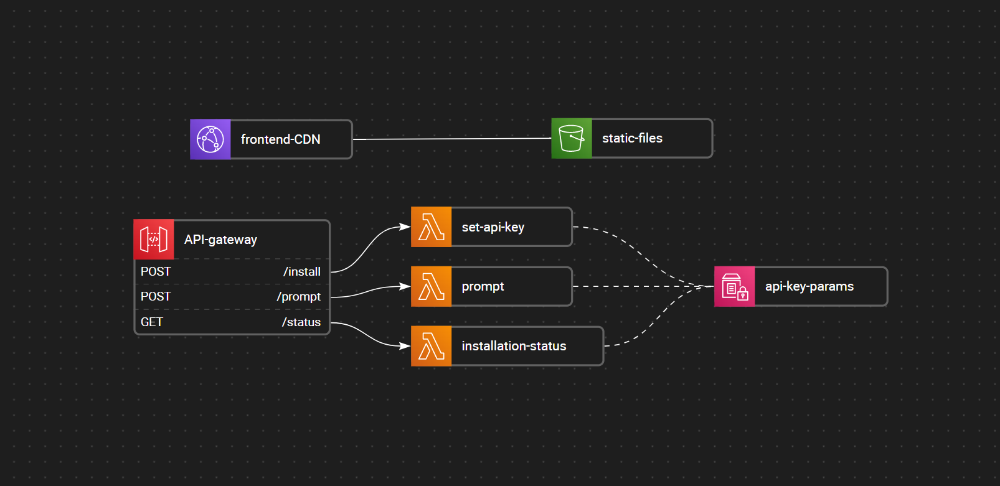
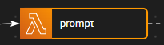

# GPT App Template

An Altostra template for a web application that let users send prompts to one of OpenAI textual models.

## Template content

An Altostra template to create projects that can be deployed with a serverless web application
that features a simple web UI for users to send prompts to a preselected OpenAI GPT model.

The infrastructure is managed using Amazon Web Services (AWS) and includes:

1. Amazon CloudFront for distributing the website content globally with low latency and
high transfer speeds.
2. Amazon S3 bucket to store the static website content.
3. Amazon REST API Gateway to create an HTTP API.
4. Three AWS Lambda functions to handle requests to the REST API:
    - One to handle the API requests to send prompts to the OpenAI GPT model.
    - One to store an OpenAI API key in the AWS Systems Manager (SSM) Parameter Store
as a SecureString.
    - One to check the existence of the API key in the AWS Systems Manager (SSM) Parameter Store.



---

The website served by the CloudFront distribution first checks the existence of an OpenAI API key.

If the API key does not exist, the web application requests an API key from the user and stores it
using the API Gateway and corresponding Lambda function.

Once the API key exists, the web application lets the user enter a prompt and send it through
the API Gateway to the corresponding Lambda function that sends it to the OpenAI GPT model.

### Options

There are two environment variables that can be changed to change the behavior of the web application:

- The GPT model that is being used (defaults to `text-davinci-003`).
- The name of the AWS Systems Manager (SSM) parameter that stores the OpenAI API key
(defaults to `gpt-api-key`).

To change either option, edit the project using VSCode with the
[Altostra extension](https://marketplace.visualstudio.com/items?itemName=Altostra.altostra).  
Follow the provided instructions and then create a new version and deploy it
(the following snippet assumes a stack named `my-stack`):

```shell
alto deploy my-stack --push --env production
```

#### Changing the GPT model that is being used


To change the GPT model, first review what
[OpenAI textual models](https://platform.openai.com/docs/models/overview) are available.
You can also get a comprehensive list using
[OpenAI API](https://platform.openai.com/docs/api-reference/models/list).  
After selecting a model, copy its ID and follow these instructions to set it as the application model:

1. Open the project in VSCode.
2. Click **on the icon** of the `prompt` lambda resource. 
3. Expand the `Environment Variables` section.
4. Change the value of the variable named `GPT_MODEL`.
5. Click on Save.

#### Changing the name of the SSM parameter that stores the API key

Multiple deployments of the project in the same region will use the same OpenAI API key.  
In order to support more than one API key in the same region - you can change the name
of the AWS Systems Manager (SSM) parameter that stores the OpenAI API key, and
[create a version](https://docs.altostra.com/reference/concepts/versions-repository#creating-a-new-project-version)
that when deployed, uses another API key.

To change AWS Systems Manager (SSM) parameter that stores the OpenAI API key,
follow these instructions:

1. Open the project in VSCode.
2. Open the project's [Global variables](https://docs.altostra.com/cloud-designer/global-environment).
3. Change the value of the variable named `GPT_API_KEY_PARAM`.
4. Click on Save.
5. Click **on the icon** of the `api-key-params` SSM Parameters resource.
6. Change the name of the sole parameter to match exactly the name you have typed for the
`GPT_API_KEY_PARAM` global environment variable.
7. Click on Save.
